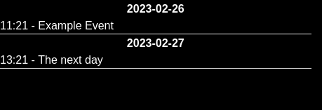
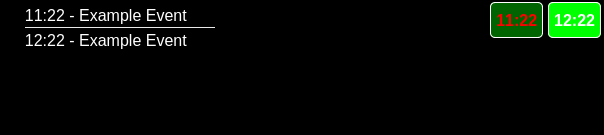

# Calendar

Add your iCal calendars to this extension and display the events on your Teletron display. You can
choose to show all upcoming events, or the time of the first and last event of the day.

## Upcoming

## First / Last event of the day

This shows the component (left) that you can configure on your display, and the widget (right).

For the widget you can choose your own front and backend colors.

## iCal calendars

Use the following tutorials to find the iCal URL for your calendar:

- [Google calendar](https://support.pushpay.com/s/article/How-do-I-get-an-iCal-feed-from-Google-Calendar)
- [Apple calendar](https://www.techrepublic.com/article/how-to-find-your-icloud-calendar-url/)
- [Office 365](https://support.pushpay.com/s/article/How-do-I-get-an-iCal-link-from-Office-365)

Once you have found the iCal URL for your calendar you can add it via the CMS. In the left bar there
will be a header called **calendars** with the option _calendars_ below it. Here you can manage your
calendars. Once a calendar is added, it can be select to be displayed as part of a widget or component.

# Attributions

The loader is `dot-revolve` from [css-spinners](https://github.com/n3r4zzurr0/svg-spinners).
