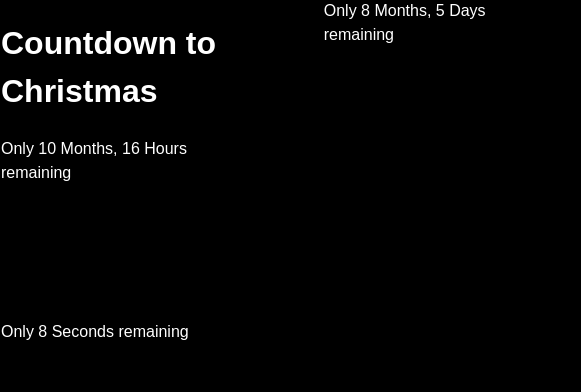

# Countdown

Configure one or more countdown timers.

It's possible to configure:

1. The date to countdown to
2. Optionally a specific time
3. A title to show above the timer
4. The text to show when the specified time has been reached.

## Example

The recording belows show a simple summary of the possibilities. It shows 3 configured
timers that each count down to respectively Christmas, Halloween and the next 15 seconds.

