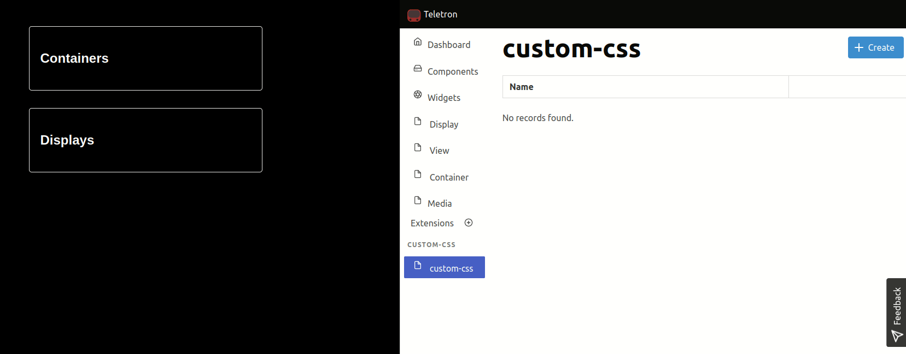

# Custom CSS

Use this extension to inject custom CSS into your Teletron page. After installation, in the CMS, find the _custom-css_
header in the left menu bar.

On this page you can create multiple CSS styles to inject. Every insertion, update or deletion of the CSS rules are
immediately visible on your Teletron displays.

