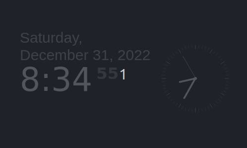

# Magic Mirror Clock extension

This extension is a wrapper around the Magic Mirror [clock module](https://docs.magicmirror.builders/modules/clock.html).

All credits for its implementation go to its original author(s). Read the software's [copyright notice](https://github.com/MichMich/MagicMirror/blob/master/LICENSE.md). More information on the module can be found in the [MagicMirror docs](https://docs.magicmirror.builders/modules/clock.html).

This extension wraps this Magic Mirror clock module to work inside [Teletron](https://www.teletron.me) as an extension.

## Features

This clock has an extended array of features. It can:

1. Display a digital clock, analog, or both
2. 12/24 hour display + optionally AM/PM
3. Show solar and lunar times
4. Show/hide seconds
