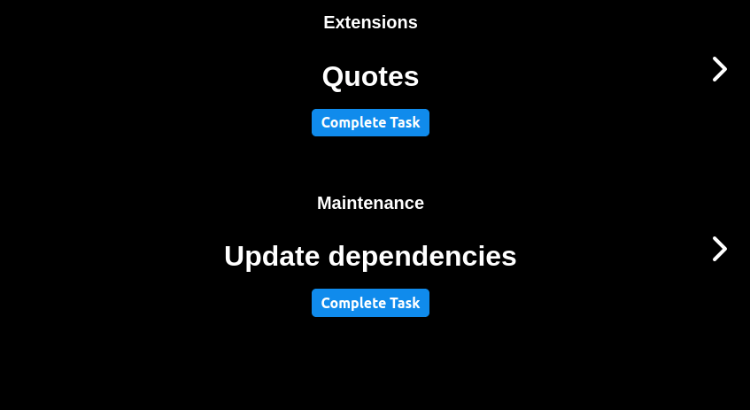

# Task Rotator Extension

This extension allows you to create a set of task carrousels that are related.

The starting point is that you have a group of tasks you go through periodically. And for each
of these tasks you have the same subtasks that you perform.

It allows you to easily go through repeating tasks, keeping track of where you are. It's
also possible to navigate through the tasks and then to easily return to your active task.

There is no limit to the number of sections you can configure.

## Example

For example, assume you are maintaining a set of [Teletron extensions](https://www.teletron.me/extensions). The list of extensions is your first carrousel with tasks.
And for each extension you have the following subtasks:

1. Update dependencies
2. Fix bugs
3. Add features
4. Release

This can be configured as shown in the gif below:

## Bottom up vs Top down

In the example above the main task is the list of extensions, while the tasks below are
executed for each extension. This example is configured **Top down**, this means that if the section
at the top is completed, the sections below it are reset to the first task.

A **Bottom up** approach is also possible. Here if a task is completed within a section,
all sections above it are reset to the start.
