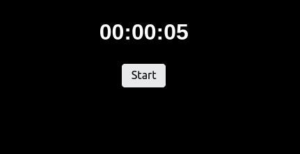

# Timer

Easily add a countdown timer to your Teletron instance. Start and stop it on your display and see the
hours, minutes and seconds tick away.

You can configure any duration you'd like. Timer durations can range from seconds to hours.

The progress on the timer is saved in the browser, so it keeps working when you refresh the page.
