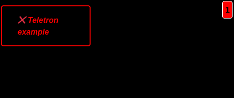

# UptimeRobot

This extensions displays your Uptime Robot information. It will show you when one or more of your monitor
entries fails. If offers both a widget and a component, so you can choose your own level of detail.

The widget will display a ✔️ or the number of monitors with an error. The component displays a ✔️ or a list
of the monitors with an error.

## Configuration

Its configuration requires your Uptime Robot API key. You can retrieve this by opening your
[UptimeRobot dashboard](https://uptimerobot.com/dashboard)], clicking/tapping your email address
in the top right corner and selecting _My Settings_.

In the bottom right of your settings page there is a section called _ API Settings_. There you
can copy the _Read-Only API Key_ and paste that in your Teletron configuration of the extension,
in the CMS.

You can access your extension configuration by opening the _Extensions_ menu option in the CMS.

# Attributions

The loader is `dot-revolve` from [css-spinners](https://github.com/n3r4zzurr0/svg-spinners).
